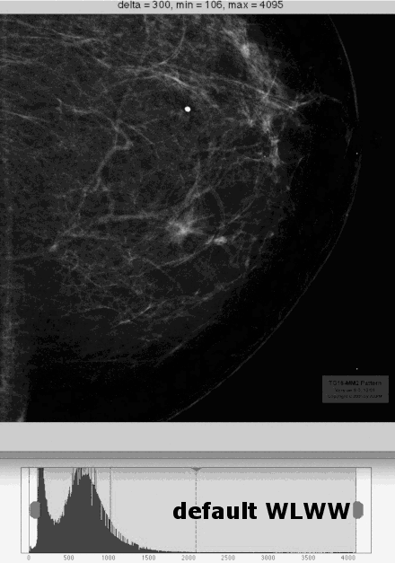
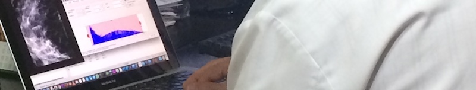

# About GRAIL

**GRAIL** (*Gabor-relying adjustment of image levels*) seeks the intensity window that maximizes the visual information when displaying a 12 bit mammogram in 8 bit displays. The proposed technique is in turn based on [Gabor filters](https://en.wikipedia.org/wiki/Gabor_filter) and the [human visual system](https://en.wikipedia.org/wiki/Visual_system).


# Demo

This simple animation shows the result of the iterative optimal intensity search process.

 


This example uses the second [2k mammography pattern](http://deckard.mc.duke.edu/~samei/tg18_files/TG18-MM-dcm.zip) available at the home page of the [TG18](http://deckard.mc.duke.edu/~samei/tg18) group from the [AAPM](http://www.aapm.org):


# Usage

The algorithm has been implemented as a [MATLAB](https://www.mathworks.com/products/matlab/) set of function scripts but works perfectly with [GNU Octave](https://www.gnu.org/software/octave/). In this last case, it is necessary to install the [signal](http://octave.sourceforge.net/signal/) and [image](http://octave.sourceforge.net/image/) packages:

```octave
$ octave
octave:1> pkg install signal image -forge
```

The main function is `grail`, which accepts the following parameters:

```octave
[a b] = grail(path_to_12bit_mammogram, f, theta, delta, K, scale)
```

where `theta` is the number of Gabor scales, `f` is the number of Gabor frequencies, `delta` is the initial search span and `K` is the maximun number of iterations. Images can be previously downscaled for speed with the `scale` parameter. 

The values `a` and `b` represent the returned minimum and maximum intensity values. From this tuple we can easily derive the appropiate Window Level and Window Width as `WL = (b - a)/2` and `WW = b - a`. 


# Results



The data from the panel of physicians and radiologists that verified the suitability of the GRAIL method can be downloaded from [here](observers.tsv).


# Databases tested with GRAIL

- [UPMC breast tomography collection](http://www.dclunie.com/pixelmedimagearchive/upmcdigitalmammotomocollection/index.html)

- [Society of Breast Imaging collection (SBI)](https://dl.dropbox.com/s/s6ro0jsnyihg6hu/scenarios_070403.tar.bz2?dl=1)

- [Cancer Genome Atlas collection](https://gdc-portal.nci.nih.gov/search/s?facetTab=cases)

- [Integrating the Healthcare Enterprise (IHE)](http://ihedoc.wustl.edu/mesasoftware/10.15.0/dist/data/MESA-storage-B_10_11_0.zip)

- [Cancer Imaging Archive](http://www.cancerimagingarchive.net)

- [Task Group 18](http://deckard.mc.duke.edu/~samei/tg18)

  ​


# Credits

This is part of a research work developed by [Instituto de Física Corpuscular (IFIC)](http://ific.uv.es), [Universidad de Valencia](http://www.uv.es) and [Universidad Politécnica de Valencia](https://www.upv.es).

  